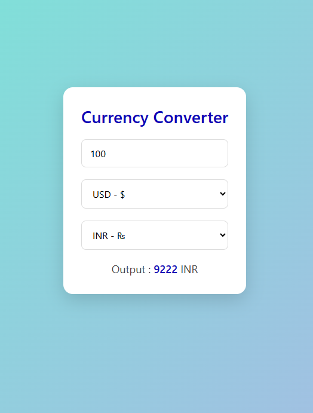

# 💱 Currency Converter — React App

A modern **React-based currency converter** that converts values between currencies using real-time exchange rates.

This project focuses on implementing **real-world frontend patterns** such as debouncing, request cancellation, and robust error handling.

---
## Preview


## 🚀 Features

### 🔢 Dynamic Currency Conversion

* Convert between multiple currencies (USD, EUR, CAD, INR)
* Real-time conversion using external API

---

### ⏱️ Debounced Input Handling

* Waits for user to stop typing before making API calls
* Prevents excessive requests
* Improves performance and user experience

---

### ⚡ Request Cancellation (AbortController)

* Cancels previous API requests when input changes
* Ensures only the latest request updates the UI
* Prevents race conditions

---

### ❌ Error Handling

* Handles invalid input (e.g., 0 or empty values)
* Displays meaningful error messages
* Clears stale data on failure

---

### ⏳ Loading State Management

* Displays "Converting..." while fetching data
* Keeps UI responsive without blocking input

---

### 🎯 Smart UI Behavior

* Prevents unnecessary API calls when:

  * Input is invalid
  * Source and target currencies are the same
* Automatically updates results based on user input

---

## 🧠 Core Concepts Demonstrated

* React Hooks (`useState`, `useEffect`)
* Side-effect management
* Debouncing technique
* AbortController for request cancellation
* Conditional rendering
* Handling async operations safely

---

## 🛠️ Tech Stack

* ⚛️ React (Functional Components)
* 🌐 Fetch API
* 🧠 AbortController
* 🎨 Basic CSS

---

## ⚙️ How It Works

### 1. Debouncing Layer

* Input changes are delayed by 500ms before triggering API call

### 2. API Layer

* Fetches exchange rate data from API

### 3. Cancellation Layer

* Previous requests are aborted when new input arrives

👉 Ensures:

* minimal API calls
* accurate and latest data

---

## ▶️ Getting Started

### 1. Clone the repository

```bash
git clone https://github.com/your-username/currency-converter.git
```

### 2. Install dependencies

```bash
npm install
```

### 3. Run the app

```bash
npm start
```

---

## 🧪 Edge Cases Handled

* Rapid typing (debouncing + request cancellation)
* Invalid input (0 or empty values)
* API failures
* Stale UI data prevention
* Same currency conversion

---

## 🎯 What This Project Shows

* Ability to optimize API calls
* Understanding of React lifecycle and effects
* Handling real-world UI problems (race conditions, async state)
* Writing clean and maintainable component logic

---

## 🚧 Future Improvements

* Add currency list from API
* Add currency swap button 🔁
* Add localStorage persistence
* Improve UI/UX design
* Add debounce as reusable custom hook

---

## 👨‍💻 Author

**Surya Teja Tangella**

---

## ⭐ Support

If you found this project useful, give it a ⭐ on GitHub!
